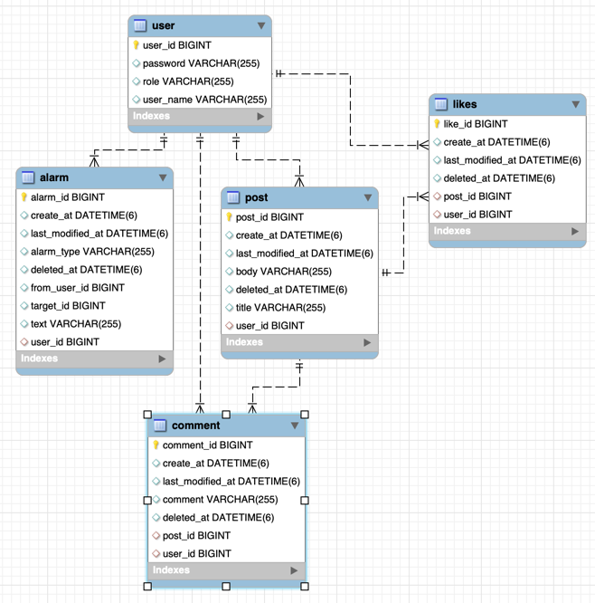

# 멋사스네스(MutsaSNS)
### URL : http://ec2-3-34-4-22.ap-northeast-2.compute.amazonaws.com:8080/swagger-ui/

<br>

### 특이사항

---
1. Security Filter와 관련한 Exception을 처리하는 부분이 어려웠다. 기존의 RestControllerAdvice로는 처리할 수 없어 Spring Security의 AccessDeniedHandler인터페이스와 AuthenticationEntryPoint인터페이스를 적용해야 했다.
   AuthenticationEntryPoint는 인증이 되지 않은 유저가 요청을 했을때 동작하는 인증 부분이다. 
   AccessDeniedHandler는 서버에 요청을 할 때 액세스가 가능한지 권한을 체크 후 액세스 할 수 없는 요청을 했을시 동작하는 인가 부분이다. Token의 유효성을 확인하는 인증 부분에 대한 예외처리는 여러 글을 읽으면서 이해할 수 있었지만, 인가에 관한 부분, 즉 403 forbidden 예외를 처리하는 구현은 아직 이해를 못해서 구현하지 못했다. 좀 더 찾아보고 이해가 되면 적용해봐야겠다.
2. 논리 삭제를 적용하면서 `@Where`을 사용하였는데 `좋아요 -> 좋아요 취소 -> 좋아요`하는 부분이 힘들었다. `@Where`를 지우고 JPQL의 `@Query` 이용해 직접 쿼리문을 작성하였는데 논리삭제 된 row를 조회 후 다시 save하는 방법을 사용하였다. 좋아요 기능을 구현해보면서 다양한 방법에 대해 고민해 보면서 많이 배웠던 것 같다. 그런데 좋아요는 물리삭제로 구현했으면 더 편했을 것 같다?..
3. 알람 구현 시 다른 Service단에 로직을 넣어야 한다는 생각을 쉽게 떠올리진 못했다. 알람 기능을 만들면서 정말 많이 수정을 해야 했다. 주어진 조건들을 보고 디테일하게 생각하지 않고 로직을 짜다 보니 놓치는 부분이 많아서 시간이 오래 걸렸는데 그만큼 많이 얻어갈 수 있었던 미션이었다. 
- 1. Alarm테이블에 Target_id의 작성자와 user_id가 일치해야 했다. 
- 2. 알람 조회 시 자신의 글에 본인이 댓글과 좋아요 남겼을 때 알람 조회가 되지 않아야 했다. 처음에는 논리 삭제된 알람까지 모두 조회가 됐다. JPA 쿼리 메서드나 JPQL을 사용해보려고 했지만 조건이 까다로워서 안될 것 같았다. 그래서 작성자와 알람보낸 회원이 같다면 좋아요나 댓글 남길 시 알람에 저장하지 않는 로직을 추가하여 해결했다. 


<br>

### 🔹 개발 환경

---
- 에디터 : Intellij Ultimate
- 개발 툴 : SpringBoot 2.7.5
- 자바 : JAVA 11
- 빌드 : Gradle 6.8
- 서버 : AWS EC2
- 배포 : Docker
- 데이터베이스 : MySql 8.0
- 필수 라이브러리 : SpringBoot Web, MySQL, Spring Data JPA, Lombok, Spring Security

<br>

### 🔹 요구 사항

---
- [x] AWS EC2에 Docker 배포
- [x] Gitlab CI & Crontab CD
- [x] Swagger
- [x] 회원가입
- [x] 로그인
- [x] 포스트 기능(작성, 수정, 삭제, 리스트)
- [x] controller, service Test 코드 작성
- [x] 댓글 기능(등록, 수정, 삭제, 리스트)
- [x] 댓글 Test
- [ ] 권한 변경(USER -> ADMIN) 
- [x] 좋아요 기능(누르기, 취소하기, 좋아요 수)
- [x] 좋아요 Test
- [x] 알람 기능(좋아요, 댓글에 대한 알람)
- [x] 알람 Test

<br>

### 🔹 목표

---
**SNS**기능을 구현해보는 개인 프로젝트입니다.

<br>

### 🔹 ERD

---


<br>

### 🔹 멋사스네스 서비스 기능

---
#### 1. 회원 인증·인가

```
- 모든 회원은 회원가입을 통해 회원이 됩니다.
- 로그인을 하지 않으면 SNS 기능 중 피드를 보는 기능만 가능합니다.
- 로그인한 회원은 글쓰기, 수정, 댓글, 좋아요, 알림 기능이 가능합니다.

                <도전과제>
- ADMIN은 USER를 ADMIN으로 승격시킬 수 있습니다.
- ADMIM은 USER의 글을 수정 삭제할 수 있습니다.
```
#### 2. 글쓰기
```
- 포스트를 쓰려면 회원가입 후 로그인(Token받기)을 해야 합니다.
- 포스트의 길이는 총 300자 이상을 넘을 수 없습니다.
- 포스트의 한 페이지는 20개씩 보이고 총 몇 개의 페이지인지 표시가 됩니다.
- 로그인 하지 않아도 글 목록을 조회 할 수 있습니다.
- 수정 기능은 글을 쓴 회원만이 권한을 가집니다.
- 포스트의 삭제 기능은 글을 쓴 회원만이 권한을 가집니다.
```
### 3. 피드
```
로그인 한 회원은 자신이 작성한 글 목록을 볼 수 있습니다.
```
### 4. 댓글
```
- 댓글은 회원만이 권한을 가집니다.
- 글의 길이는 총 100자 이상을 넘을 수 없습니다.
- 회원은 다수의 댓글을 달 수 있습니다.
```
### 5. 좋아요
```
- 좋아요는 회원만 권한을 가집니다.
- 좋아요 기능은 취소가 가능합니다.
```
### 6. 알람
```
- 알림은 회원이 자신이 쓴 글에 대해 다른회원의 댓글을 올리거나 좋아요시 받는 기능입니다.
- 알림 목록에서 자신이 쓴 글에 달린 댓글과 좋아요를 확인할 수 있습니다.
```
<br>

### 🔹 EndPoint


---

|  구분  | METHOD |                  URL                  |              기능              |           세부 기능            |                       세부 사항                        |
|:----:|:------:|:-------------------------------------:|:----------------------------:|:--------------------------:|:--------------------------------------------------:|
|  회원  |  POST  |          /api/v1/users/join           |             회원가입             |          비밀번호 암호화          |                                                    |
|      |  POST  |          /api/v1/users/login          |             로그인              |        JWT Token 발행        |                                                    |
| 포스트  |  POST  |             /api/v1/posts             |             글 등록             |                            |                                                    |
|      |  GET   |        /api/v1/posts/{postId}         |            단건 조회             |                            |                                                    |
|      |  GET   |             /api/v1/posts             |            전체 조회             |         Pagination         |                                                    |
|      |  PUT   |         /api/v1/posts{postId}         |             글 수정             |                            |                      작성자만 가능                       |
|      | DELETE |        /api/v1/posts/{postId}         |             글 삭제             |           논리 삭제            |                      작성자만 가능                       |
|  회원  |  POST  |    /api/v1/users/{id}/role/change     |            권한 변경             |    도전과제(USER -> ADMIN)     |             ADMIN은 USER 게시글에 대한 U,D 가능             |
|  댓글  |  POST  |   /api/v1/posts/{postsId}/comments    |            댓글 등록             |                            |                                                    |
|      |  GET   |    /api/v1/posts/{postId}/comments    |            댓글 조회             |         Pagination         |            @Where로 deleteAt가 null인 만 조회            |
|      |  PUT   | /api/v1/posts/{postId}/comments/{id}  |            댓글 수정             |                            |                      작성자만 가능                       |
|      | DELETE | /api/v1/posts/{postsId}/comments/{id} |            댓글 삭제             |           논리 삭제            |                      작성자만 가능                       |
| 마이피드 |  GET   |           /api/v1/posts/my            |             글 조회             |         Pagination         |                    본인의 포스트만 조회                     |
| 좋아요  |  POST  |         /posts/{postId}/likes         |           좋아요 누르기            |       논리 삭제, JPQL 사용       |                좋아요 -> 좋아요 취소 -> 좋아요                |
|      |  GET   |        /posts/{postsId}/likes         |            좋아요 개수            |               JPQL 사용             |                                                    |
|  알람  |  GET   |    /alarms     |                알람 조회         | Pagination, 논리 삭제, JPQL 사용 | 본인 포스트의 좋아요, 댓글에 대한 알람(본인 포스트에 본인이 남긴 좋아요, 댓글은 제외) |


---


###  **회원가입 : POST** `/api/v1/users/join`

- 요청 
```json
{
    "userName": "jin",
    "password": "123"
}
```
- 응답
```json
{
    "resultCode": "SUCCESS",
    "result": {
        "userId": 1,
        "userName": "jin"
    }
}
```
<br>

### **로그인 : POST** `/api/v1/users/login`
- 요청
```json
{
    "userName": "jin",
    "password": "123"
}
```
- 응답
```json
{
  "resultCode": "SUCCESS",
  "result": {
    "jwt": "eyJhbGciOiJIU"
  }
}
```
<br>


### **포스트 작성 : POST** `/api/v1/posts`
- 요청
```json
{
  "title" : "title1",
  "body" : "body1"
}
```
- 응답
```json
{
  "resultCode": "SUCCESS",
  "result": {
    "message": "포스트 등록 완료",
    "postId": 1
  }
}
```
<br>

### **포스트 단건 조회 : GET** `/api/v1/posts/{postId}`

- 응답
```json
{
  "resultCode":"SUCCESS",
  "result":{
    "id" : 1,
    "title" : "title1",
    "body" : "body",
    "userName" : "user1",
    "createdAt" : yyyy-mm-dd hh:mm:ss,
    "lastModifiedAt" : yyyy-mm-dd hh:mm:ss
  }
}
```
<br>


### **포스트 전체 조회 : GET** `/api/v1/posts`

- 응답
```json
{
  "resultCode": "SUCCESS",
  "result": {
    "content": PostDetailResponse[],
    "pageable": Pageable,
    "last": boolean,
    "totalElements": Number,
    "totalPages": Number,
    "size": Number,
    "number": Number,
    "first": boolean,
    "sort": Sort,
    "numberOfElements": Number,
    "empty": boolean
  }
}
```
<br>

### **포스트 수정 : PUT** `/api/v1/posts/{postId}`

- 요청
```json
{
  "title" : "modified title",
  "body" : "modified body"
}

```
- 응답
```json
{
  "resultCode":"SUCCESS",
  "result":{
    "message":"포스트 수정 완료",
    "postId":1
  }
}
```
<br>

### **포스트 삭제 : DELETE** `/api/v1/posts/{postId}`

- 응답
```json
{
  "resultCode":"SUCCESS",
  "result":{
    "message":"포스트 삭제 완료",
    "postId":0
  }
}
```
<br>

### **회원 권한 변경 : POST** `/api/v1/users/{id}/role/change`

- 요청
```json
{
  "role": "user" | "admin"
}
```
- 응답
```json
{
   "resultCode": "SUCCESS",
   "result": {
      "message": "관리자로 권한이 변경되었습니다.",
      "userName": "user1"
   }
}
```
<br>

### **댓글 등록 : POST** `/api/v1/posts/{postId}/comments`

- 요청
```json
{
   "comment" : "comment test4"
}
```
- 응답
```json
{
   "resultCode": "SUCCESS",
   "result":{
      "id": 4,
      "comment": "comment test4",
      "userName": "test",
      "postId": 2,
      "createdAt": "2022-12-20T16:15:04.270741"
   }
}
```
<br>

### **댓글 조회 : POST** `/api/v1/posts/{postsId}/comments`
- 응답
```json
{
   "resultCode": "SUCCESS",
   "result":{
      "content":[
         {
            "id": 3,
            "comment": "comment test3",
            "userName": "test",
            "postId": 2,
            "createdAt": "2022-12-20T16:07:25.699346"
         },
         {
            "id": 2,
            "comment": "comment test2",
            "userName": "test",
            "postId": 2,
            "createdAt": "2022-12-20T16:03:30.670768"
         }
      ],
      "pageable":{"sort":{"empty": false, "sorted": true, "unsorted": false },
         "offset": 0,…},
      "last": true,
      "totalPages": 1,
      "totalElements": 2,
      "size": 10,
      "number": 0,
      "sort":{
         "empty": false,
         "sorted": true,
         "unsorted": false
      },
      "numberOfElements": 2,
      "first": true,
      "empty": false
   }
}
```
<br>

### **댓글 수정 : PUT** `/api/v1/posts/{postId}/comments/{id}`

- 요청
```json
{
   "comment" : "modify comment"
}
```
- 응답
```json
{
   "resultCode": "SUCCESS",
   "result":{
      "id": 4,
      "comment": "modify comment",
      "userName": "test",
      "postId": 2,
      "createdAt": "2022-12-20T16:15:04.270741",
      "lastModifiedAt": "2022-12-23T16:15:04.270741"
   }
}
```
<br>

### **댓글 삭제 : DELETE** `/api/v1/posts/{postsId}/comments/{id}`

- 응답
```json
{
   "resultCode": "SUCCESS",
   "result":{
      "message": "댓글 삭제 완료",
      "id": 4
   }
}
```
<br>

### **마이 피드 : GET** `/api/v1/posts/my`
- 응답
```json
{
   "resultCode": "SUCCESS",
   "result":{
      "content":[
         {
            "id": 4,
            "title": "test",
            "body": "body",
            "userName": "test",
            "createdAt": "2022-12-16T16:50:37.515952"
         }
      ],
      "pageable":{
         "sort":{"empty": true, "sorted": false, "unsorted": true }, "offset": 0,…},
      "last": true,
      "totalPages": 1,
      "totalElements": 1,
      "size": 20,
      "number": 0,
      "sort":{
         "empty": true,
         "sorted": false,
         "unsorted": true
      },
      "numberOfElements": 1,
      "first": true,
      "empty": false
   }
```
<br>

### **좋아요 누르기 : POST** `/posts/{postId}/likes`

- 응답
```json
{
   "resultCode":"SUCCESS",
   "result": "좋아요를 눌렀습니다."
}
```
<br>

### **좋아요 개수 : GET** `/posts/{postsId}/likes`

- 응답
```json
{
   "resultCode":"SUCCESS",
   "result": 0
}
```

<br>

### **알람 조회 : GET** `/alarms`

- 응답
```json
{
   "resultCode":"SUCCESS",
   "result": {
      "content":
      [
         {
            "id": 1,
            "alarmType": "NEW_LIKE_ON_POST",
            "fromUserId": 1,
            "targetId": 1,
            "text": "new like!",
            "createdAt": "2022-12-25T14:53:28.209+00:00",
         }
      ]
   }
}
```
<br>


