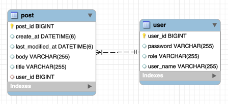

# 멋사스네스(MutsaSNS)
### Swagger
http://ec2-13-209-97-233.ap-northeast-2.compute.amazonaws.com:8080/swagger-ui/
## 개발 환경
- 에디터 : Intellij Ultimate
- 개발 툴 : SpringBoot 2.7.5
- 자바 : JAVA 11
- 빌드 : Gradle 6.8
- 서버 : AWS EC2
- 배포 : Docker
- 데이터베이스 : MySql 8.0
- 필수 라이브러리 : SpringBoot Web, MySQL, Spring Data JPA, Lombok, Spring Security

---
## 프로젝트 소개
Spring Security를 적용한 회원가입, 로그인과 게시글 기능, 댓글 기능, 좋아요 기능을 도입하여 게시판을 만드는 개인 프로젝트입니다

---
## ERD

---

## 서비스 소개
### 1️⃣ **회원 인증·인가**

- 모든 회원은 회원가입을 통해 회원이 됩니다.
- 로그인을 하지 않으면 SNS 기능 중 피드를 보는 기능만 가능합니다.
- 로그인한 회원은 글쓰기, 수정, 댓글, 좋아요, 알림 기능이 가능합니다.

### 2️⃣ 글쓰기

- 포스트를 쓰려면 회원가입 후 로그인(Token받기)을 해야 합니다.
- 포스트의 길이는 총 300자 이상을 넘을 수 없습니다.
- 포스트의 한 페이지는 20개씩 보이고 총 몇 개의 페이지인지 표시가 됩니다.
- 로그인 하지 않아도 글 목록을 조회 할 수 있습니다.
- 수정 기능은 글을 쓴 회원만이 권한을 가집니다.
- 포스트의 삭제 기능은 글을 쓴 회원만이 권한을 가집니다.

---
### EndPoint

**POST** `/api/v1/users/join` - 회원가입  
**POST** `/api/v1/users/login` - 로그인  
**POST**`/api/v1/posts` - 포스트 작성  
**GET**`/api/v1/posts/{postId}` - 포스트 단건 조회  
**GET**`/api/v1/posts` - 포스트 전체   
**UPDATE**`/api/v1/posts/{postId}` - 포스트 수정   
**DELETE**`/api/v1/posts/{postId}` - 포스트 삭제

  

